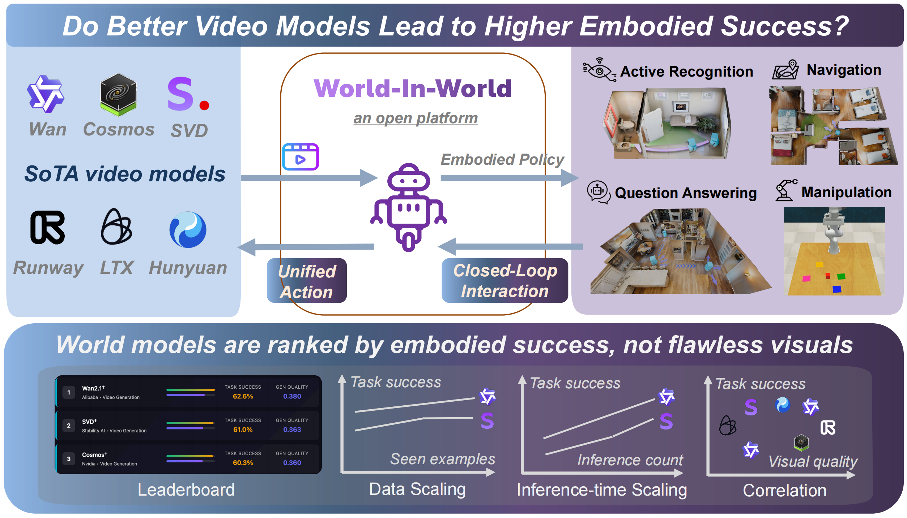

<!-- # World-in-World -->

<p align="center">
  
</p>

<div align="center">
  <a href="https://world-in-world.github.io/"></a>
  <a href="https://arxiv.org/abs/"></a>
  <a href="https://huggingface.co"></a>
  <a href="https://github.com/World-In-World/world-in-world" target="_blank"></a>
</div>

World-in-World is a unified **closed-loop** benchmark and toolkit for evaluating **visual world models (WMs)** by their **embodied utility** rather than image/video visuals alone. World-in-World provides (1) a unified online planning strategy that works with different WMs, (2) a unified action API that adapts to text, viewpoint, and low-level controls, and (3) a suite of tasks spanning Active Recognition (AR), Active Embodied QA (A-EQA), Image-Goal Navigation (ImageNav), and Robotic Manipulation.

---

## 📰 News
- **2025-10-17**: Preprint released on arXiv. Landing page and repository initialized.

---

## ✨ Overview



In this work, we propose World-in-World, which wraps generative <u>World</u> models <u>In</u> a closed-loop <u>World</u> interface to measure their practical utility for embodied agents. *We test whether generated worlds actually enhance embodied reasoning and task performance*—for example, helping an agent perceive the environment, plan and execute actions, and re-plan based on new observations *within such a closed loop*. Establishing this evaluation framework is essential for tracking genuine progress across the rapidly expanding landscape of visual world models and embodied AI.

---

## 📦 Repository Status

**Under construction**
- [ ] Full documentation and tutorials for environment setup and evaluation.
- [ ] Evaluation episodes, datasets, and checkpoints.
- [ ] WM deployment instructions.
- [ ] Additional tools and post-training scripts.

---

## 🚀 Getting Started

### 1) Environment


### 2) Datasets


### 3) Checkpoints

## 🧰 Quickstart
Step-by-step examples for running closed-loop evaluation and post-training will appear here with the initial release.

---

## 📊 Results and Visualizations
Quantitative tables and qualitative rollouts will be added with the paper materials (leaderboard, logs, and videos).

---

## 📝 Citation

If you find this work useful, please cite:
```bibtex
@article{worldinworld2025,
  title   = {World-in-World: <placeholder subtitle>},
  author  = {First Author and Others},
  journal = {arXiv preprint arXiv:XXXXX},
  year    = {2025}
}
